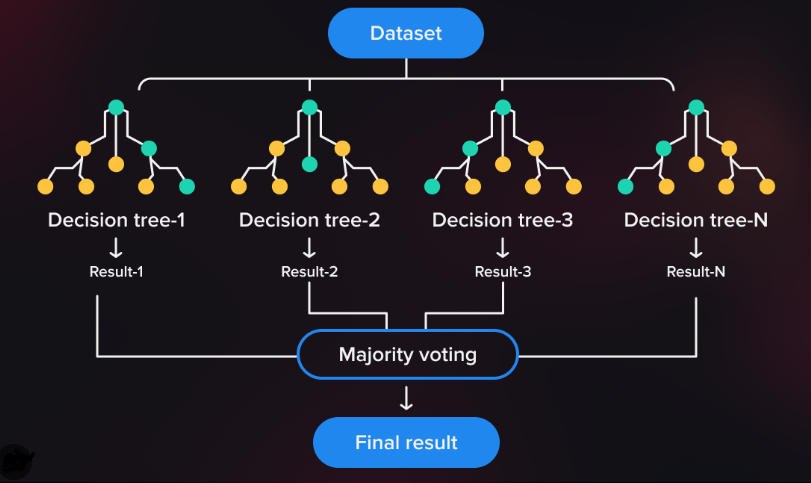
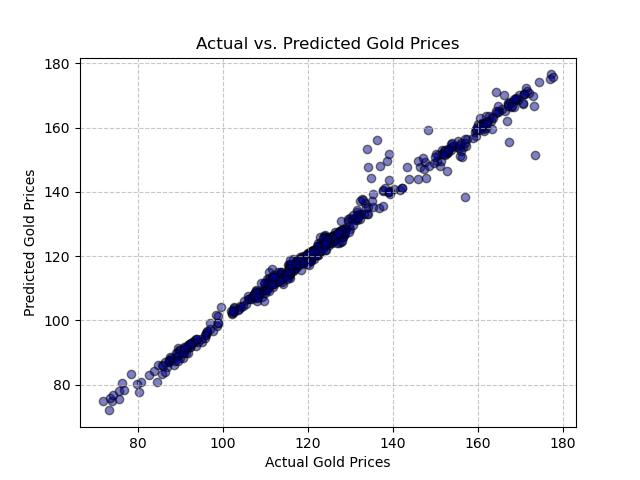
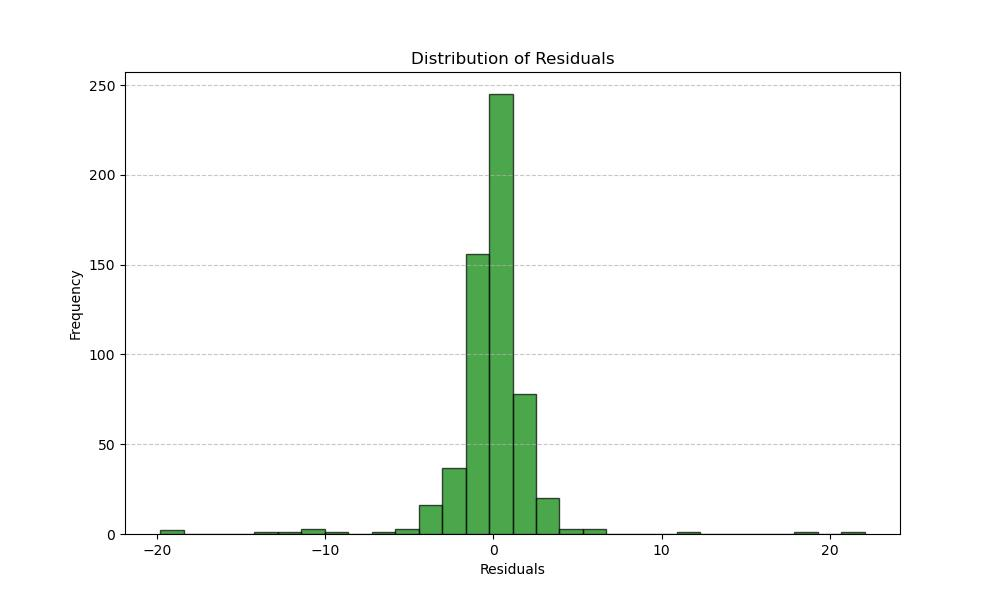
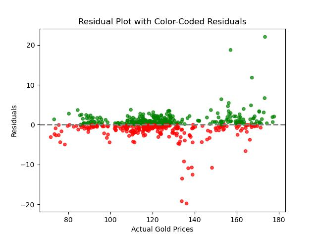
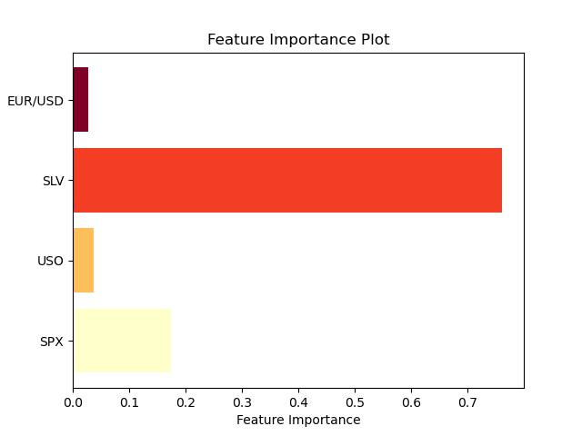

# Project4
Instructor: Steven Greene  
Bootcamp: DU-VIRT-DATA-PT-06-2023  
29 November 2023  

## Table of Contents
- [About](#about)
- [Visualizations](#visualizations)
- [Summary](#summary)
- [Contributing](#contributing)
- [Resources](#resources)

## About
For Project 4, we built a supervised machine learning model using the Random Forest Regressor to predict gold prices. Random Forest Regressor is a popular machine learning algorithm for regression tasks, and it can be quite effective for predicting numerical values, such as gold prices. During training, it builds multiple decision trees and, when making predictions, outputs the average of the individual tree predictions. In essence, it leverages the collective wisdom of these trees to provide a more robust and accurate regression model.  

## Visualizations
  
This scatter plot compares the actual gold prices with the predicted gold prices. The close alignment of data points along the diagonal line from the bottom left to the top right indicates a strong positive correlation between the predicted and actual prices. Most predictions are close to the actual values, showing that the model used for prediction is performing well. There is a cluster of points along the line, suggesting high accuracy, with some variance as the prices increase. There are a few notable deviations, especially at higher price levels, where the model appears to underpredict the actual price.  

  
This histogram titled "Distribution of Residuals" visualizes the frequency of residuals, which represent the differences between observed and predicted values. The residuals are centered around zero, indicating that predictions are mostly accurate. The distribution is approximately symmetrical, suggesting that the model does not systematically over or underpredict. The highest frequency of residuals is close to zero, and frequencies decrease as residuals move away from zero, which is indicative of a well-performing model. There are few extreme values, showing that there are few large errors in prediction.  

  
This residual plot shows the differences between observed and predicted gold prices. The data points, color-coded in green and red, mostly cluster around the horizontal zero line, indicating a generally good prediction accuracy. Green points represent more accurate predictions than red points. There's no apparent pattern of increasing or decreasing residuals with gold prices, suggesting consistent variance and a well-fitted model. Some outliers, particularly in the red, may require further investigation.  

  
The "Feature Importance Plot" visualizes the significance of different features in a predictive model. Four features are displayed: EUR/USD, SLV, USO, and SPX. The length of the bars represents the relative importance of each feature.
   - EUR/USD has the smallest bar, indicating the least importance.  
   - SLV has a very long bar, suggesting it is the most significant predictor in the model.  
   - USO has a moderately long bar, indicating a medium level of importance.  
   - SPX's bar is slightly longer than EUR/USD's, suggesting it has a low to moderate influence.  
   The colors may represent different categories or types of features, but without a legend, it's unclear what they signify. The plot clearly communicates that SLV is the most influential feature in this model.  

## Summary

## Contributing
- <a href="https://www.github.com/ryguy57/" target="_blank">Ryan Himes</a>
- <a href="https://www.github.com/jgrubb38/" target="_blank">Jennifer Grubb</a>
- <a href="https://www.github.com/agostinger/" target="_blank">Adam Gostinger</a>

## Resources
<a href="https://www.kaggle.com/datasets/altruistdelhite04/gold-price-data"> Kaggle Dataset: Gold Price Data</a>  
